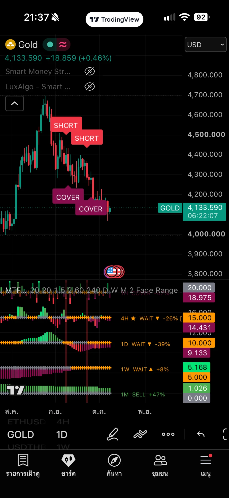

# trading

อินดิเคเตอร์และโน้ตสำหรับ TradingView (Pine Script v6)

## Folder

| Path | ใช้เก็บอะไร |
|---|---|
| `pine/sqzmom_lazybear_v6.pine` | Squeeze Momentum ของ LazyBear เขียนใหม่เป็น v6 (ตรรกะเดิมทุกอย่าง) |
| `pine/mtf_sqzmom_v3.pine` | **MTF Squeeze Momentum v3**: histogram 5 time frame ซ้อนกันในแผงเดียว พร้อมสัญญาณ BUY / SELL / SHORT / COVER |
| `pine/smc_sqz_v1.pine` | **SMC + SQZ Confluence v1**: Smart Money Concepts บนกราฟราคา (BOS / CHoCH, order block, FVG, EQH / EQL, premium / discount) พร้อมสัญญาณ SMC ▲ / ▼ ที่กรองด้วยโมเมนตัม SQZ และโครงสร้าง TF ใหญ่ |
| `docs/sqzmom_guide.md` | คู่มือฉบับเต็ม: ตรรกะของ SQZMOM, วิธีอ่านป้าย, กฎเข้าออก, time frame ที่เหมาะ, วิธีติดตั้งและเผยแพร่ |
| `.claude/skills/smart-money-concepts/SKILL.md` | skill ให้ Claude ใช้อ่านกราฟและแก้โค้ดด้วย SMC: นิยาม, ลำดับ setup, กฎการเขียน Pine |

## ตัวอย่างบนกราฟ

MTF Squeeze Momentum v3 บนกราฟ Gold (1D) ใน TradingView: ป้าย SHORT / COVER บนกราฟราคา และ histogram 5 time frame ในแผงล่าง

## ใช้งานเร็ว

1. เปิด tradingview.com แล้วเปิด Pine Editor → **Open → New indicator**
2. ลบโค้ดเดิมทิ้ง แล้ววางโค้ดจาก `pine/mtf_sqzmom_v3.pine`
3. กด **Save** แล้วกด **Add to chart** โดยตั้งกราฟเป็น **4H** ให้ตรงกับแถว trigger ที่เป็นค่าเริ่มต้น
4. (ถ้าต้องการ) ทำซ้ำข้อ 1–3 กับ `pine/smc_sqz_v1.pine` เพื่อเพิ่ม SMC บนกราฟราคา ใช้คู่กับ MTF SQZ ได้เลย

## Credit & License

- ตรรกะ squeeze/momentum มาจาก **Squeeze Momentum Indicator [LazyBear]** ซึ่งอิงแนวคิด TTM Squeeze ของ John Carter
- โค้ดใน repo นี้ใช้สัญญาอนุญาต [Mozilla Public License 2.0](LICENSE)

> ⚠️ โค้ดยังไม่ได้ทดสอบรันใน TradingView และกฎเข้าออกยังไม่ได้ backtest ไม่ใช่คำแนะนำการลงทุน
